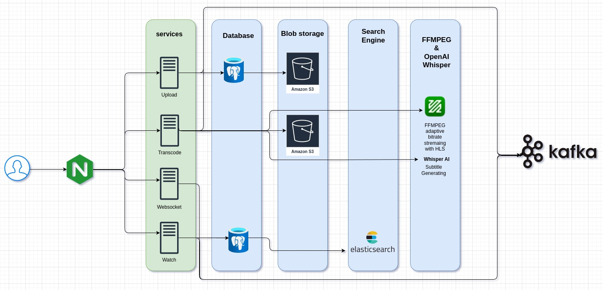
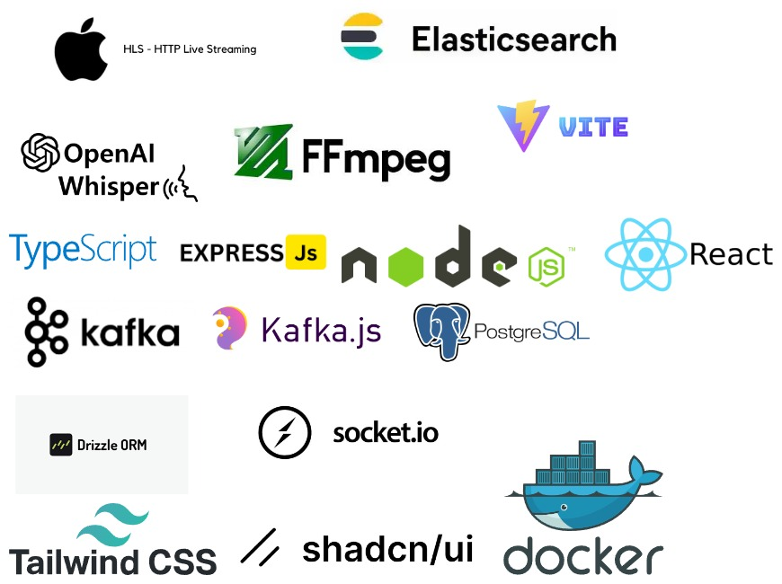

## Transform Video Streaming with Seamless Transcoding: A Scalable, Real-Time Solution Powered by NGINX, Kafka, and AI
> [!NOTE]  
> For running AI auto-subtitle generation, you don't need an OpenAI API key because whisper AI is an open-source pretrained model.

### Transcoding Service Project: Key Features

#### 1. **Upload Service**
   - Uploads video files in chunks using AWS S3 Multipart Upload.
   - Enhances load balancing by distributing the upload process across multiple servers.
   - Reduces dependency on a single server during the upload process.

#### 2. **Kafka Message Production**
   - Upon successful upload, produces a message to Kafka to trigger the following:
     - **Transcoding Service**: For video transcoding and subtitle generation.
     - **Elasticsearch Indexing**: For indexing video metadata in Elasticsearch for improved search capabilities.

#### 3. **Transcoding Service**
   - **Message Consumption**:
     - Consumes the Kafka message to start the transcoding process.
   - **Subtitle Generation**:
     - Utilizes a Whisper pre-trained AI model to generate subtitles.
     - Operates without the need for external API keys, ensuring self-contained processing.
   - **Adaptive Bitrate Streaming**:
     - Transcodes video into various formats to support Adaptive Bitrate Streaming using HLS (HTTP Live Streaming).
   - **Progress Monitoring**:
     - Produces progress updates during transcoding and subtitle generation.
     - Sends progress updates to the client via a WebSocket service, using Socket.IO for real-time communication.

#### 4. **HLS Master Playlist Generation**
   - Generates an HLS master playlist that references all the transcoded video segments.

#### 5. **S3 Upload for Transcoded Chunks**
   - Uploads the transcoded video chunks back to AWS S3 for storage and delivery.

#### 6. **Watch Service and Elasticsearch Integration**
   - **Message Production**:
     - After transcoding, produces a message containing video data.
   - **Message Consumption**:
     - The "Watch" service consumes this message to save video data to Elasticsearch.
     - Facilitates indexing for better search and retrieval of video content.

#### 7. **API Gateway with NGINX**
   - Utilizes NGINX as an API Gateway to manage and route traffic efficiently between different services.
   - Handles load balancing, request routing, and acts as a reverse proxy for all microservices.
   - Ensures secure, scalable, and high-performance API management across the system.

This comprehensive feature set highlights the key components and their interactions within your transcoding service project, ensuring efficient video processing, real-time progress tracking, robust search capabilities, and optimized API management with NGINX.
Certainly! Here’s how you can structure the **Services** section in your project documentation for your GitHub README. This section provides an overview of each service in your project, describing its purpose and functionality.

---

## Services

### 1. Upload Service

The **Upload Service** handles the initial upload of video files. It provides endpoints for uploading video chunks and manages the multipart upload process. Once the upload is complete, it sends a message to Kafka indicating that a video has been uploaded, which triggers subsequent processing.

**Key Features:**
- Handles video file uploads via chunked requests.
- Manages multipart upload to ensure large files are uploaded in parts.
- Publishes a Kafka message to notify other services of the completed upload.

**Tech Stack:**
- Node.js
- Express.js
- KafkaJS
- AWS S3 for storage

** Endpoints:**
- `POST /upload/initialize` - Initiates a multipart upload.
- `POST /upload` - Uploads a video chunk.
- `POST /upload/complete` - Finalizes the upload process.

---

### 2. Transcoder Service

The **Transcoder Service** processes video files after they are uploaded. It listens for Kafka messages indicating a video has been uploaded and performs tasks such as generating different resolutions of the video, creating subtitles, and extracting audio for further processing. The service also publishes progress updates to Kafka.

**Key Features:**
- Consumes Kafka messages to start video processing.
- Uses FFmpeg for video transcoding and subtitle generation.
- Publishes progress updates and final results to Kafka topics.

**Tech Stack:**
- Node.js
- FFmpeg
- KafkaJS
- AWS S3 for temporary storage

** Topics:**
- `VideoProcessing` - Consumes messages about videos that need processing.
- `ProgressEvents` - Publishes progress updates during video transcoding.

---

### 3. Watch Service

The **Watch Service** handles real-time monitoring and playback of videos. It connects to Kafka to listen for messages about video processing completion and updates the user interface with real-time progress and status. This service ensures that users get timely updates on their video status.

**Key Features:**
- Subscribes to Kafka topics to receive updates about video indexing.
- Add add data to the Elastic search
- Handle Search and listing video

**Tech Stack:**
- Node.js
- KafkaJS

** Topics:**
- `VideoEvents` - Consumes messages related to video status updates.
- `SearchIndexEvents` - consume message and indexing to elastic-search

---

### 4. WebSocket Service

The **WebSocket Service** facilitates real-time communication between the client and server. It is used for sending real-time updates on video processing, upload progress, and other notifications. This service helps keep the user interface synchronized with the backend processing.

**Key Features:**
- Provides real-time updates via WebSocket connections.
- Manages multiple WebSocket connections efficiently.
- Broadcasts progress updates and notifications to connected clients.

**Tech Stack:**
- Node.js
- socket.io
- Kafkajs
- express.js

---

Feel free to adjust the descriptions and tech stack based on the actual implementation details of your services. This documentation will help others understand the roles and responsibilities of each service within your project.